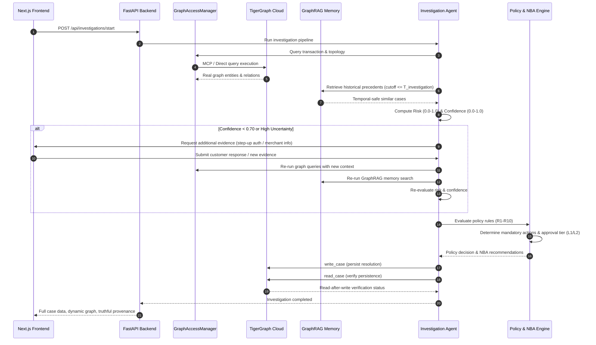

# FraudLens — Final Production Architecture Specification

FraudLens is an agentic fraud investigation system combining TigerGraph's Knowledge Graph, Model Context Protocol (MCP), GraphRAG hybrid memory, and deterministic policy enforcement for financial fraud triage.

---

## 1. High-Level System Architecture

```text
                    FraudLens Agent
                          |
             +------------+------------+
             |                         |
        TigerGraph                  GraphRAG
             |                         |
        MCP / Direct              Vector Memory
             |                         |
             +------------+------------+
                          |
                  Investigation Context
                          |
                   LLM Reasoning
                          |
              Risk + Uncertainty
                          |
                Evidence Request
                          |
                    Reassessment
                          |
                  Policy Engine
                          |
                    NBA Engine
                          |
                  Human Approval
                          |
                 TigerGraph Writeback
```

---

## 2. Component Breakdown

### 2.1 Authoritative Graph Access Layer (`GraphAccessManager`)
- **Location:** `tools/graph_access_manager.py`
- **Modes:**
  - `mcp`: Strictly routes operations through `tigergraph-mcp` official tools registry (`tigergraph__run_installed_query`, `tigergraph__get_vertex_count`, `tigergraph__get_node`, `tigergraph__get_node_edges`).
  - `direct`: High-throughput direct `pyTigerGraph` SDK connection.
  - `auto`: Default mode. Attempts MCP first and gracefully falls back to direct SDK if transport issues occur.
- **Truthful Provenance Accounting:**
  - `mcp_calls`: Counts only real MCP protocol invocations.
  - `direct_calls`: Counts direct SDK calls.
  - `access_mode`: Explicitly reports `"mcp"` or `"direct"`.

### 2.2 GraphRAG Hybrid Memory Pipeline
- **Structural Graph Retrieval:** GSQL query `search_similar_cases` with native GSQL temporal cutoff (`closed_at <= before_ts`).
- **Semantic Vector Memory:** `LocalVectorStore` indexing 5,565 historical closed cases using TF-IDF text representation with strict 1:1 document-embedding vector alignment and temporal filtering.
- **Reciprocal Rank Fusion (RRF):** Graph score (60% weight) + Semantic score (40% weight).
- **Dynamic Re-Investigation Loop:** Re-executes both graph evidence retrieval and GraphRAG historical context when supplementary evidence arrives, preventing stale context reuse.

### 2.3 Deterministic Policy & Next-Best-Action (NBA) Engine
- **Location:** `policy/policy_engine.py`, `policy/rules.py`, `agent/nba_engine.py`
- **Guarantees:** Rules R1–R10 and actions A1–A14 are non-negotiable hard constraints evaluated directly on verified evidence metrics. LLMs provide explanations and summaries but cannot override deterministic thresholds.
- **Approval Routes:** Automated (`auto`), Tier-1 Analyst (`L1`), or Tier-2 Supervisor (`L2`). High-risk exposure ($\ge \$10,000$) automatically upgrades to L2 approval and requires Suspicious Activity Report (SAR) filing.

### 2.4 Read-After-Write Verified Writeback
- Every resolved investigation generates a `write_case` mutation to TigerGraph and is immediately verified via a subsequent read query (`get_case` / `getVerticesById`).
- `writeback_verified` is only `true` when the record on the live graph matches the persisted case ID, status, and verdict.

---

## 3. End-to-End Investigation Flow


