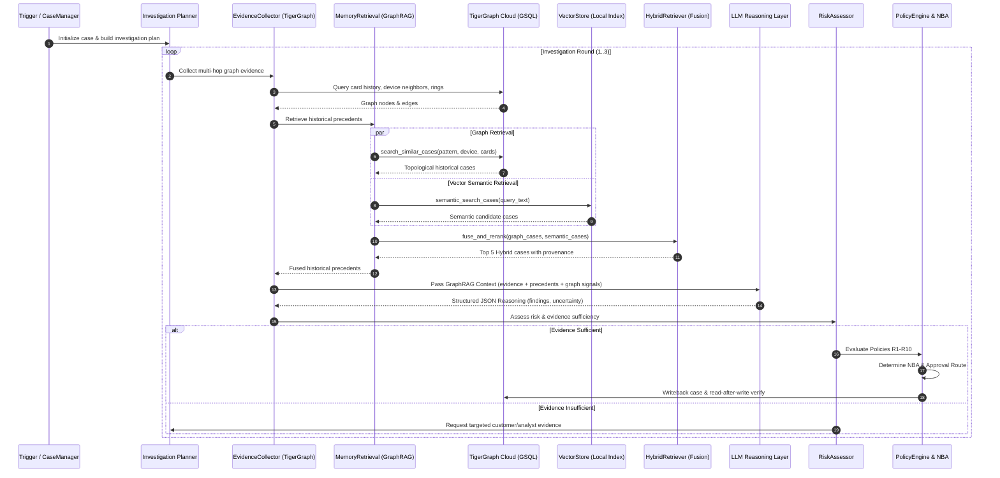

# FraudLens — GraphRAG Runtime Flow

## Step-by-Step Investigation Lifecycle

---

## Provenance Breakdown Example

| Historical Case | Retrieval Mode | Graph Relevance | Semantic Relevance | Hybrid Relevance | Source |
|---|---|---|---|---|---|
| **CC-0141** | `hybrid` | 0.850 | 0.942 | **0.887** | `Hybrid: TigerGraph + VectorStore` |
| **CC-2671** | `hybrid` | 0.720 | 0.895 | **0.790** | `Hybrid: TigerGraph + VectorStore` |
| **CC-3312** | `semantic` | 0.000 | 0.794 | **0.595** | `VectorStore / analyst_notes embedding` |
| **CC-1528** | `semantic` | 0.000 | 0.793 | **0.595** | `VectorStore / analyst_notes embedding` |
| **CC-2823** | `semantic` | 0.000 | 0.791 | **0.593** | `VectorStore / analyst_notes embedding` |
